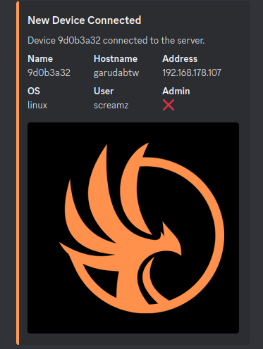

# Discord Webhook Plugin
This plugin will post a message using a Discord webhook when a device connects to the server.

## Configuration
Add this to your config file to enable the plugin:
```toml
[plugins.discord_webhook]
enabled = true
webhook_url = "your webhook url"
```

## Preview
